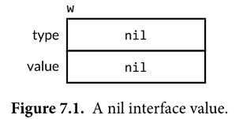
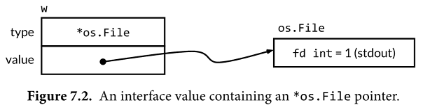
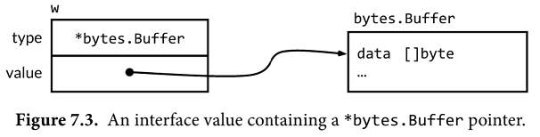

# 7장. 인터페이스

### 7.1 문법

```go
type 인터페이스명 interface {
	// 메소드 정의
}
```
  > 예시) 
```go
package io
type Writer interface { 
    Write(p []byte) (n int, err error)
}
```

------

### 7.2  속성

- #### 메소드와  호출자간의 **동작에 대한 규약**을 정의하는 추상 타입이다.

> (예시) 
>
> `Fprintf` 메소드를 호출하는 호출자는, `io.writer` 라는 interface (고유의 Write 동작 가진 구현체 )  를 파라메터로 전달해야 한다.

```go
package fmt
func Fprintf(w io.Writer, format string, args ...interface{}) (int, error)
func Printf(format string, args ...interface{}) (int, error) {
    return Fprintf(os.Stdout, format, args...)
}
func Sprintf(format string, args ...interface{}) string {
	var buf bytes.Buffer 
	Fprintf(&buf, format, args...) 
	return buf.String()
}
```


- #### 약속된 동작을 인터페이스의 **메소드**로 정의한다.

  - 구상 타입이 필수로 가져야 하는 메소드를 정의한다.

  - 메소드 기술은 아래 2가지 모두 혼용 가능하다.
    - 직접 메소드를 기술하는 방법 (①)

    - 이미 정의된 인터페이스를 embedding 하는 방법 (②)


> (예시)  io.Writer 인터페이스를 embedding 함 
```go
// (예시)  io.Writer 인터페이스를 embedding 함 
type ReadWriter interface { 
	Read(p []byte) (n int, err error) // ①
	Writer	// ②
}
```


- #### 인터페이스에 정의된 모든 메소드가 존재해야 할당된다.


> (예시 1)  변수 초기화로 할당하기

```go
var w io.Writer
w = os.Stdout                      // 정상 : *os.File는 Write 메소드 존재
w = new(bytes.Buffer)              // 정상 : *bytes.Buffer는 Write 메소드 존재
w = time.Second                    // 컴파일 에러 : time.Duration는 Write 메소드 부재

var rwc io.ReadWriteCloser
rwc = os.Stdout                    // 정상: *os.File는  Read, Write, Close 메소드 존재
rwc = new(bytes.Buffer)            // 컴파일 에러 : *bytes.Buffer는 Close 메소드 부재
```

> (예시 2)  변수로 대입 할당하기

```go
var w io.Writer
w = rwc                            // 정상 : io.ReadWriteCloser는 Write 메소드 존재
rwc = w                             // 컴파일 에러 : io.Writer는 Write 메소드 부재
```


- #### interface {}

  - 요구 조건이 없는 인터페이스. 어떤 값도 할당 할 수 있다.

> (예시)  
```go
package fmt

func Println(a ...interface{}) (n int, err error) {
	return Fprintln(os.Stdout, a...)
}
```


- #### 인터페이스의 추가의 자유도가 높다.

  - 구상 타입과의 Relation이 필수가 아니므로, 기존 구상 타입의 선언을 변경 할 필요가 없다.
  - 인터페이스 설계 및 확장 과정의 예시

    > << 구상 타입 예시 >>
    ```
        Album 
        Book 
        Movie 
        Magazine 
        Podcast 
        TVEpisode 
        Track
    ```
    > Step 1 : 공통적인 동작을 추출하여 추상화
    ```go
    type Artifact interface { 
        Title() string 
        Creators() []string 
        Created() time.Time
    }
    ```
    > Step 2 : 기타 동작을 추출하여 추상화
    ```go
    type Text interface { 
        Pages() int 
        Words() int 
        PageSize() int
    }
    type Audio interface { 
        Stream() (io.ReadCloser, error) 
        RunningTime() time.Duration 
        Format() string // e.g., "MP3", "WAV"
    }
    type Video interface { 
        Stream() (io.ReadCloser, error) 
        RunningTime() time.Duration 
        Format() string // e.g., "MP4", "WMV" 
        Resolution() (x, y int)
    }
    ```
    > Step 3 : 기존 인터페이스 간의 새로운 추상화
    ```go
    type Streamer interface { 
        Stream() (io.ReadCloser, error) 
        RunningTime() time.Duration 
        Format() string
    }
    ```

------

### 7.3  인터페이스의 동적 타입과 값

- #### Type Descriptors
  ###### 인터페이스의 타입과 값을 표현하는 방법

- #### 인터페이스의 값

  ###### -  `nil`로 암묵적 초기화된 인터페이스 값

  ```go
  var w io.Writer 
  ```
  

  ###### - *os.File를 포함한 인터페이스 값
  ```go
  w = os.Stdout 
  ```
  
  ###### - *bytes.Buffer를 포함한 인터페이스 값
  ```go
  w = new(bytes.Buffer) 
  ```
  
  ###### - `nil`로 명시적 초기화한 인터페이스 값
  ```go
  w = nil
  ```
  

  ###### - `nil`포인터를 가진 `nil` 아닌 인터페이스 값
  ```go
  const debug = true
  func main() { 
  	var buf *bytes.Buffer 
  	if debug {
  		buf = new(bytes.Buffer)
  	}
  	f(buf) // 포인터를 전달한다는 것에 유의
  	if debug { 
  		// ...use buf...
  	}
  }
  func f(out io.Writer) { 
      // out(=buf) 는 포인터이므로
      // out의 value와 무관하게
      // 아래 조건문은 항상 true
  	if out != nil { 
          // out(=buf) 이 nil이 되는 경우 (debug = false)
          // Write 호출시 패닉 발생
          // bytes.Buffer는 Reciever가 nil이면 인터페이스 충족 조건이 안됨
  		out.Write([]byte("done!\n"))
  	}
  }
  ```
  

### 7.5  주요 인터페이스의 활용

- #### sort.Interface를 활용한 Sorting
  ```go
  // sort.Interface
  package sort
  type Interface interface { 
      Len() int           // 시퀀스 길이
      Less(i, j int) bool // 원소 비교 방법
      Swap(i, j int)      // 원소 교환 방법
  }
  ```

  ```go  
  // 구상 타입
  type StringSlice []string
  func (p StringSlice) Len() int {return len(p) } 
  func (p StringSlice) Less(i, j int) bool { return p[i] < p[j] } 
  func (p StringSlice) Swap(i, j int) {p[i], p[j] = p[j], p[i] }
  
  sort.Sort(StringSlice(names))	// names는 slice
  ```

- #### http.Handler 인터페이스
  ```go  
  // net.http
  package http
  // 인터페이스
  type Handler interface {
  	ServeHTTP(w ResponseWriter, r *Request)
  }
  // 메소드에서 사용
  func ListenAndServe(address string, h Handler) error
  ```

  ```go
  // 구상 타입
  func main() {
  	db := database{"shoes": 50, "socks": 5}
  	log.Fatal(http.ListenAndServe("localhost:8000", db))
  }
  
  type dollars float32
  func (d dollars) String() string { return fmt.Sprintf("$%.2f", d) }
  
  type database map[string]dollars
  // 인터페이스 메소드 구현
  func (db database) ServeHTTP(w http.ResponseWriter, req *http.Request) {
  	for item, price := range db {
  		fmt.Fprintf(w, "%s: %s\n", item, price)
  	}
  }
  ```

- #### error 인터페이스

  ```go
  package builtin
  
  package error
  // 인터페이스
  type error interface { 
  	Error() string
  }
  ```

  ```go
  // 구상 타입
  
  package syscall
  
  type Errno uintptr // operating system error code
  
  var errors = [...]string{
      1: "operation not permitted", // EPERM 
      2: "no such file or directory", // ENOENT 
      3: "no such process", // ESRCH 
  }
  
  // 인터페이스 메소드 구현
  func (e Errno) Error() string { 
      if 0 <= int(e) && int(e) < len(errors) {
          return errors[e] 
      }
      return fmt.Sprintf("errno %d", e)
  }
  ```

- #### 산술 표현식 평가기(Arithmetic expression Evaluator)
  - ##### 인터페이스 정의 (ast.go)

  ```go
  // 인터페이스
  type Expr interface {
      // Env에서 표현식의 값을 반환
  	Eval(env Env) float64
      // 표현식의 에러를 보고하고, vars에 Var를 추가
  	Check(vars map[Var]bool) error
  }
  
  // call 구조체 선언
  type call struct {
  	fn   string // one of "pow", "sin", "sqrt"
  	args []Expr
  }
  ```
  - ##### Eval 메소드 구현 (eval.go)
  ```go
  func (c call) Eval(env Env) float64 {
  	switch c.fn {
  	case "pow":
  		return math.Pow(c.args[0].Eval(env), c.args[1].Eval(env))
  	case "sin":
  		return math.Sin(c.args[0].Eval(env))
  	case "sqrt":
  		return math.Sqrt(c.args[0].Eval(env))
  	}
  	panic(fmt.Sprintf("unsupported function call: %s", c.fn))
  }
  
  ```
  - ##### Check 메소드 구현 (check.go)
  ```go
  func (c call) Check(vars map[Var]bool) error {
  	arity, ok := numParams[c.fn]
  	if !ok {
  		return fmt.Errorf("unknown function %q", c.fn)
  	}
  	if len(c.args) != arity {
  		return fmt.Errorf("call to %s has %d args, want %d",
  			c.fn, len(c.args), arity)
  	}
  	for _, arg := range c.args {
  		if err := arg.Check(vars); err != nil {
  			return err
  		}
  	}
  	return nil
  }
  var numParams = map[string]int{"pow": 2, "sin": 1, "sqrt": 1}
  ```
  - ##### Test (eval_test.go)
  ```go
  
  // Eval 테스트
  func TestEval(t *testing.T) {
      // 테스트 입력값
  	tests := []struct {
  		expr string	// 표현식
  		env  Env	// 표현식 대입값
          want string	// 정답(기대값)
  	}{
  		{"sqrt(A / pi)", Env{"A": 87616, "pi": math.Pi}, "167"},
  		{"pow(x, 3) + pow(y, 3)", Env{"x": 12, "y": 1}, "1729"},
  		{"pow(x, 3) + pow(y, 3)", Env{"x": 9, "y": 10}, "1729"}
  	}
      // 평가 결과 변수
  	var prevExpr string
  	for _, test := range tests {
  		// Print expr only when it changes.
  		if test.expr != prevExpr {
  			fmt.Printf("\n%s\n", test.expr)
  			prevExpr = test.expr
  		}
          // 표현식 Parsing
  		expr, err := Parse(test.expr)
  		if err != nil {
  			t.Error(err) // parse error
  			continue
  		}
          // 표현식 평가 수행
  		got := fmt.Sprintf("%.6g", expr.Eval(test.env))
  		fmt.Printf("\t%v => %s\n", test.env, got)
  		if got != test.want {// 에러 일때만 출력
  			t.Errorf("%s.Eval() in %v = %q, want %q\n",
  				test.expr, test.env, got, test.want)
  		}
  	}
  }
  
  // Check 테스트
  func TestErrors(t *testing.T) {
      
  	for _, test := range []struct{expr string, 		// 표현식
                                    wantErr string // 정답(기대값)
                                   }{
  		{"sqrt(1, 2)", "call to sqrt has 2 args, want 1"}
  	} {
  		expr, err := Parse(test.expr)
  		if err == nil {
  			vars := make(map[Var]bool)
              // 체크 수행
  			err = expr.Check(vars)
  			if err == nil {
  				t.Errorf("unexpected success: %s", test.expr)
  				continue
  			}
  		}
  		fmt.Printf("%-20s%v\n", test.expr, err) // (for book)
  		if err.Error() != test.wantErr {
  			t.Errorf("got error %s, want %s", err, test.wantErr)
  		}
  	}
  }
  ```
### 7.6  인터페이스의 타입 단언

- #### 타입 단언 (Type Assertion)

  - 표기법

  ```go
  x.(T)	// x : 인터페이스 타입, T : 단언 타입
  ```

  - T 가 구상 타입인 경우,  x 의 동적 타입이 T와 같은지 확인
  ```go
  var w io.Writer 
  w  = os.Stdout 
  f: = w.(*os.File)      // 정상 : f == os.Stdout 
  c: = w.(*bytes.Buffer) // 패닉 : interface holds *os.File, not *bytes.Buffer
  ```
  - T 가 인터페이스 타입인 경우,  x 의 동적 타입이 T를 충족하는지 확인
  ```go
  var w io.Writer 
  w   = os.Stdout 
  rw := w.(io.ReadWriter) // 정상 : *os.File 는 Read, Write 메소드 없음
  w   = new(ByteCounter) 
  rw  = w.(io.ReadWriter) // 패닉: *ByteCounter는 Read 메소드 없음
  ```

- #### 타입 단언으로 오류 식별을 구조화 가능

  > 예시) 파일 경로에 대한 작업 실패를 구조화한 사례

  ```go
  package os
  
  type PathError struct { 
      Op   string // 동작
      Path string // 파일 경로
      Err   error	// 에러(단순 문자열보다 상세 정보 가짐)
  }
  
  func (e *PathError) Error() string { 
  	return e.Op + " " + e.Path + ": " + e.Err.Error()
  }
  ```

- #### 타입 단언으로 동적 조회 가능

  > 예시) WriteString

  ```go
  // writeString writes s to w. 
  // If w has a WriteString method, it is invoked instead of w.Write. 
  func writeString(w io.Writer, s string) (n int, err error) { 
  type stringWriter interface {
  	WriteString(string) (n int, err error) 
  }if sw, ok := w.(stringWriter); ok {
  return sw.WriteString(s) // avoid a copy 
  }return w.Write([]byte(s)) // allocate temporary copy
  }
  func writeHeader(w io.Writer, contentType string) error { 
  if _, err := writeString(w, "Content-Type: "); err != nil {
  return err 
  }if _, err := writeString(w, contentType); err != nil {
  return err 
  }// ...
  }
  ```

